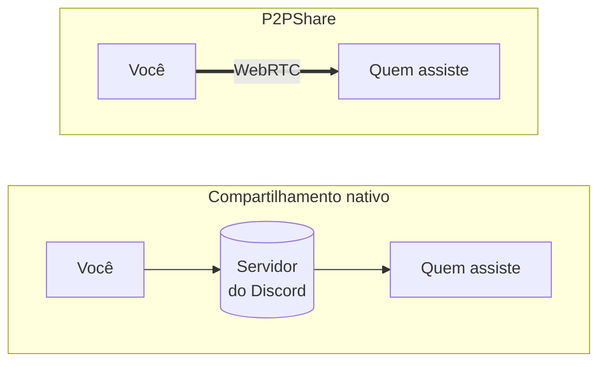

# P2PShare

**Compartilhamento de tela ponto-a-ponto para o Discord.** O vídeo vai direto do
seu PC para o de quem assiste — não passa por servidor nenhum, nem o do Discord,
nem o meu, nem o seu.

[](https://github.com/andrewmautone/discord-p2pshare/releases/latest)
[](#licença)
[](https://betterdiscord.app)

---

## Por que existe

O compartilhamento de tela do Discord passa pela infraestrutura de vídeo deles, e
a qualidade tem teto: resolução, taxa de quadros e bitrate são limitados do lado
do servidor.

O P2PShare tira o intermediário. A conexão é WebRTC direto entre os dois
computadores — sem cap de bitrate, com latência menor, e sem servidor nenhum no
meio para pagar, manter ou confiar.



**E a negociação da conexão?** Ela viaja em mensagens do próprio Discord, que o
plugin apaga sozinho depois. É isso que dispensa qualquer servidor de
sinalização.

---

## Instalação

### Pelo instalador

Baixe o **[P2PShare-Setup.exe](https://github.com/andrewmautone/discord-p2pshare/releases/latest)**
e execute. Ele instala o BetterDiscord se você ainda não tiver, e cuida do resto.

> O Windows vai avisar que o programa não é assinado. Clique em
> **Mais informações → Executar assim mesmo**. Assinatura de código custa caro
> e este é um projeto pessoal.

### Na mão

Se você já usa BetterDiscord:

1. Baixe o **[P2PShare.plugin.js](https://github.com/andrewmautone/discord-p2pshare/releases/latest)**
2. No Discord: **Configurações → BetterDiscord → Plugins → Open Plugins Folder**
3. Arraste o arquivo para dentro da pasta
4. Ligue o **P2PShare** na lista

Pronto — não precisa reiniciar.

### Atualizações

O plugin se atualiza sozinho. Nunca no meio de uma transmissão, e sempre avisando
depois. Dá para desligar nas configurações se você preferir aprovar cada versão.

---

## Como usar

**Transmitir** — entre num canal de voz e clique no botão P2P, que fica ao lado
do botão de compartilhar tela do Discord. Escolha a janela ou o monitor. Enquanto
transmite, o botão fica vermelho e mostra quantas pessoas estão assistindo.
Clique de novo para parar.

**Assistir** — quando alguém do canal começa a transmitir, aparece um aviso com o
botão **Assistir**. A janela do vídeo é arrastável, redimensionável e tem
controle de volume. Fechar a janela para de assistir de verdade — e o aviso
reaparece se você quiser voltar.

Quem transmite vê uma prévia da própria tela com a lista de quem está conectado.

---

## Como funciona

| Peça | O que faz |
|---|---|
| **Beacon** | Uma mensagem legível no canal anunciando a transmissão, com o identificador da sessão escondido em caracteres invisíveis. Quem não tem o plugin lê só o texto e o link de instalação. |
| **Handshake** | O `offer`/`answer` do WebRTC vai por DM entre os dois, como anexo `.txt`, e é apagado em 20 segundos. Se a DM estiver bloqueada, volta para o canal. |
| **Mídia** | WebRTC direto entre os pares, com STUN público apenas para descobrir os endereços. |

A topologia é **mesh**: quem transmite mantém uma conexão por espectador, todas
enviando a mesma imagem. O orçamento de upload é dividido entre eles
automaticamente — 15 Mbps dão 1080p60 para duas pessoas ou 720p30 para seis.

O ICE é não-trickle: cada lado espera terminar de descobrir os candidatos e manda
um SDP único. Custa uns segundos no início, mas transforma a negociação em uma
mensagem por lado — o que torna viável usar um chat como canal de sinalização.

---

## Limitações

Vale ler antes de instalar.

**Todo mundo precisa do plugin.** Quem não tem vê apenas uma mensagem normal no
chat, com o link para instalar. Não quebra nada para essas pessoas.

**Algumas conexões não fecham.** Não há servidor de retransmissão (TURN), então
quem estiver atrás de NAT simétrico — CGNAT de operadora, certas redes
corporativas — não consegue conectar. O plugin avisa quando é o caso, em vez de
ficar esperando para sempre.

**A qualidade cai conforme entra gente.** Seu upload é dividido entre os
espectadores. Acima de umas seis pessoas não vale mais a pena.

**Áudio depende do sistema.** A captura de som do Windows costuma funcionar
compartilhando a tela inteira, mas nem sempre com uma janela específica. Sem
loopback disponível, a transmissão vai muda em vez de falhar.

**Client mods violam os Termos de Serviço do Discord.** Vale para o
BetterDiscord e para este plugin. Na prática banimentos por isso são raros, mas o
risco é seu.

---

## Desenvolvimento

O código é um só e compila para dois alvos: BetterDiscord e Vencord. Tudo que é
específico de cada um vive atrás de uma interface (`host/`), então a lógica de
protocolo e WebRTC não sabe onde está rodando.

```bash
git clone https://github.com/Vendicated/Vencord
cd Vencord && pnpm i
git clone https://github.com/andrewmautone/discord-p2pshare src/userplugins/p2pShare

# testes (runner nativo do Node, sem dependência nova)
pnpm exec tsx --test src/userplugins/p2pShare/*.test.ts

# build do BetterDiscord: gera o .plugin.js e o instalador
cd src/userplugins/p2pShare && node scripts/build-bd.mjs

# build do Vencord
cd ../../.. && pnpm build && pnpm inject
```

Os módulos de lógica (`codec`, `beacon`, `bitrate`, `capture`, `peers`,
`handshake`, `updater`) não importam nada do Discord — é isso que os deixa
testáveis fora do navegador.

Para publicar uma versão: suba `PLUGIN_VERSION` em `constants.ts`, rode o build,
faça o push e crie a release. O número da versão vem daí para o cabeçalho do
plugin e para o instalador, e é ele que o auto-update compara.

---

## Licença

GPL-3.0-or-later, herdada do [Vencord](https://github.com/Vendicated/Vencord),
de onde vêm os utilitários usados na versão para aquele mod.
